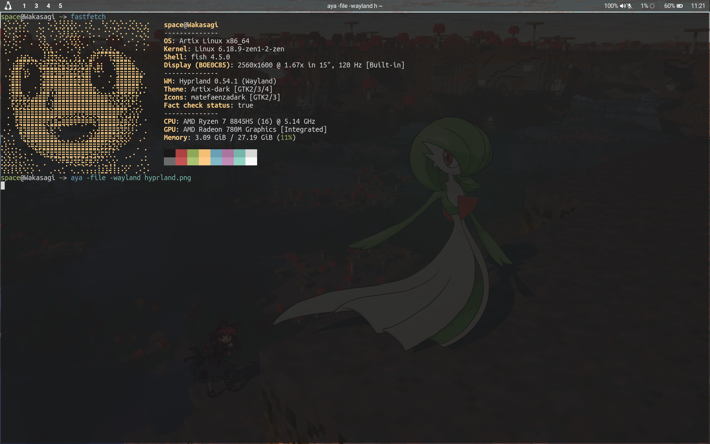

# My experience with daily driving Wayland (2026)

In late-2025 I made a post about my frustrating experience with setting up a Wayland environment with Hyprland, Labwc and Wayfire and trying to combine them with xfce tools.

I have made significant progress on Hyprland in particular to the point where I unexpectedly started daily driving it. I will write here a status update on how I see Wayland as well as how I made it work properly.

## My original issues

I had multiple issues with Wayland, available compositors and the ecosystem:
* Blurry text and images when using fractional scaling
* Xwayland stubbornly scales, resulting in pixelated/blurry upscaling
* No screen tearing for playing games
* Xfce programs not working perfectly
* Fewer software than on x11 for setting up a window manager (panel, cli tools, etc)
* Shitty documentation and online information, especially for non-systemd distros
* Screensharing not working and DBus fuckeries

I can say that I have fixed or mitigated all of these issues and now I am very comfortably daily driving Hyprland.

## Why Hyprland and how it fixed many issues

The Wayland ecosystem has a fragmentation problem. The core specification is not enough for the necessities of desktop use and so different compositors have different quirks, behavior, bugs and features because they all have their own implementations and extensions. wl-roots includes a lot of central functionality and is overall the most UNIX-friendly ecosystem because there's CLI tools made for it that are pipeline-friendly that let you take screenshots, copy and paste clipboard, etc all while passing the data through standard input and output.

However, wl-roots seems to be slow to evolve and has some severe issues that have to be fixed yet, such as the [fractional scaling blurryness problem](https://gitlab.freedesktop.org/wlroots/wlroots/-/issues/3991). Hyprland is the best of both worlds because it's compatible with tools made for wl-roots while also fixing and implementing things that are not yet in wl-roots. Hyprland was originally based on wl-roots and any improvements it had on top were contributed back, but the lead developer was banned from the entire Freedesktop Gitlab instance for stupid political reasons, in the end they lost a very important contributor. Hyprland has hard-forked wl-roots since then, with many great improvements while also keeping compatibility.

Hyprland is also very well documented, with an extensive wiki covering pretty much everything you need to know. A lot of Wayland tools and desktops lack documentation, guides and critical information for setting things up yourself. Sure that's tolerable on KDE or similar desktops because they handle everything for you, but if you want things done your way and done by yourself it's a huge pain.

## Fractional scaling in Hyprland

Unlike all wl-roots compositors (currently), Hyprland keeps text, images and UI elements of programs very sharp while you use display scaling. This was one of the reasons I didn't want to use Wayland, trying to read text on wl-roots compositors felt like I was losing my eyesight.

## Screen tearing capability in Hyprland

After enabling the screen tearing capabilities in Hyprland's configuration, the compositor will disable desktop vsync once you open a fullscreen game. This works on Team Fortress 2 but I couldn't confirm anywhere else. I don't know if this capability works on Xwayland, Gamescope or WINE/Proton, but even without screen tearing I don't feel that the input lag hinders you even for critical games like Touhou or rhythm games.

## Xwayland display scaling

Hyprland allows you to force no display scaling for applications running on Xwayland. This fixes the blurry and pixelated upscale in these programs, finally you can reliably use x11-only programs and games properly. Many compositors either don't have this feature or have it but it did not work for me.

## DBus, making screensharing work and fixing a bunch of shit

DBus is a gigantic clusterfuck of a horribly-documented program, but unfortunately it's mandatory to use if you want to have screensharing to work on Wayland or certain programs (such as Waybar or Xfce programs) to have their full featureset. Little information is out there about setting up DBus on Wayland because for most systems (systemd) user DBus is automatically working under the hood and people don't even think about it. Running DBus as root as a service is easy, but what I was lacking that was breaking a lot of things was DBus as a user service. Since it's not guaranteed that an init system will have user service support, you have to run DBus as a user service yourself before launching your Wayland compositor.

My solution for screensharing and all kinds of DBus-depending software was to, instead of having my display manager (LightDM) run `start-hyprland`, have it run `dbus-run-session start-hyprland`. This will launch DBus as a user service and have it launch Hyprland with full access and awareness of it. This command alone fixed all DBus-related problems on all software.

On Hyprland specifically, for screenshare to work, I also have to manually execute the respective portal with `exec-once = /usr/lib/xdg-desktop-portal-hyprland` in my Hyprland config file.

## Setting up Hyprland to my liking

Hyprland is simultaneously modern and lightweight. I can have it be overloaded with eye candy just as much as I can make it extremely minimal and lightweight. Configuring Hyprland was very pleasurable and sane. I also take advantage of the ecosystem by using hyprsunset and hyprpaper. Setting environment variables and Wayland quirks is no longer necessary as `start-hyprland` does it for you.

## Getting used to tiling

I'm a hardcore floating window manager user, or so I used to be but now I'm adapting really well to how Hyprland does tiling. And if for some reason I need floating, Hyprland has got me covered. Yeah, if you want to run Hyprland 100% in floating mode then you will need a plugin for window title bars, but I avoided that hassle entirely by adapting to how tiling works. I do miss minimizing windows though.

## Building my desktop environment

Now with Hyprland configured, I need the rest of my software. I don't need much as I like to use scripts, CLI or GUI software directly than applets, widgets and all kinds of things that are DE-specific, but I still needed to satisfy some necessities.

* For hardware control and monitoring I use my own [Nitori](https://github.com/spacebanana420/nitori) program
* For screenshots, I use my [Aya](https://github.com/spacebanana420/aya)
* For clipboard, I use wl-copy
* Hyprlock for a lockscreen
* To have a panel, I currently use Waybar
* I used to use xfce4-terminal but now I use Alacritty
* I still use Thunar despite not being on Xfce now
* I still use pavucontrol and connman-gtk to handle audio and network.
* I use hyprlauncher as a start menu but I'm not a big fan of it, it uses a bit too much ram and doesn't detect pavucontrol for some reason

## Conclusion

Hyprland has fixed many issues present in wl-roots compositors while still providing compatibility with the wl-roots environment. I also had to fix some things myself and use more barebones software for certain features, but now I am daily driving a Wayland environment comfortably.

The Wayland ecosystem has potential and it will eventually catch up with x11, but right now there needs to be a higher focus on documentation (for developer and end-user), tooling, cross-compositor functionality, improving critical issues (scaling blurryness), and maybe having a lower dependency on DBus. As compositors improve and tooling improves and becomes more diversified, the ecosystem will be able to satisfy more people, and people will feel a weaker necessity to use a mainstream desktop environment like KDE.

Here's a screenshot of my current setup:

